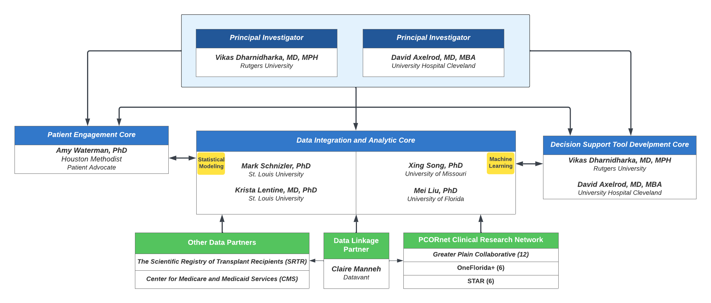

# Choosing ImmunoSuppression regimens in renal Transplant by Efficacy and Morbidity 2 (CISTEM2) 

Funding agency: NIH/NIDDK  
Funding period: 4/1/2024 - 3/30/2029  
PI: Vikas Dharnidharka, MD (Rutgers); David Axelrod, MD (Case Western)  
Co-PI/Co-I: Xing Song (MU)  
Project Number: [1R01DK139339](https://reporter.nih.gov/search/dL0HHLs6gUu6A9ABsvEWxQ/project-details/10859534#description)  
GPC ROA: [ROA Request](/ref/GPCResearchOpportunityAssessme_2022-12-20_2125.pdf)  
GPC DROC:   

# Study Overview 

Recognizing the data continuum gaps in CISTEM [e.g., lack of longitudinal information on more granular clinical observations and outcome measures, such as serum creatinine levels (for computation of estimated glomerular filtration rate, eGFR), tacrolimus drug levels, measures of viremia and viuria, biopsy reports (for defining acute rejection (AR) and other forms of graft injury), malignancy diagnoses, rehospitalization events], we will establish a novel, robust and curated database (CISTEM2 database) integrating transplant registry data with multi-site electronic medical records (EMRs), administrative claims, and social determinants of health data for renal transplant patients leveraging the PCORnet infrastructure. 

- [Specific Aims](/ref/SPECIFIC%20AIMS_CISTEM2_20230401.pdf)
- [Site SOW and Budget](/ref/CISTEM2_NIH_R01_SOW-w-Budget.pdf)
- [Introduction Deck](/ref/CISTEM2_intro_deck.pdf)
- [NIH Data Management and Sharing Plan](/ref/CISTEM2_NIH_Data-Managemen-Sharing-Plan.pdf)

# Study Team 

# Data Linkage and Integration Workflow

